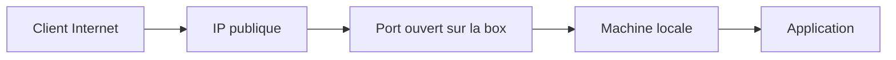
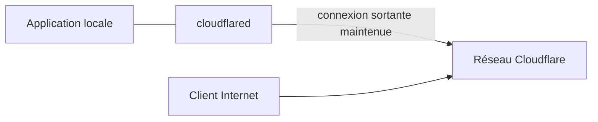
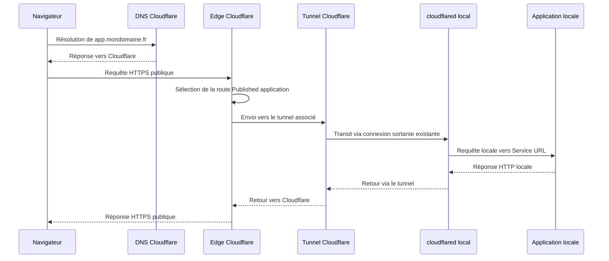
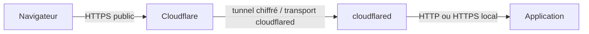
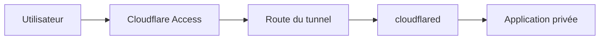

# 00 — Principe technique & sécurité Cloudflare Tunnel

> Document de base à lire avant les autres.
>
> Ce guide explique le fonctionnement technique de Cloudflare Tunnel, la place exacte de `cloudflared`, le chemin réseau d’une requête, les couches TLS, les limites de sécurité et les erreurs de conception à éviter.

---

## 1. Idée générale

Cloudflare Tunnel permet de rendre un service local accessible depuis Internet sans exposer directement une IP publique ni ouvrir de port entrant sur la box ou le pare-feu.

La différence fondamentale avec une redirection NAT classique est le sens de connexion initial.

Dans une redirection classique, Internet entre vers le réseau local :



Avec Cloudflare Tunnel, la machine locale sort vers Cloudflare :



Le poste ou serveur local ne reçoit pas directement une connexion entrante depuis Internet. Le connecteur `cloudflared` maintient une ou plusieurs connexions sortantes vers le réseau Cloudflare. Les requêtes publiques sont ensuite relayées à travers cette connexion déjà établie.

---

## 2. Les composants de l’architecture

| Composant | Rôle |
|---|---|
| Client Internet | Navigateur ou client qui visite `https://app.mondomaine.fr`. |
| DNS Cloudflare | Résout le nom public et l’associe à l’infrastructure Cloudflare. |
| Edge Cloudflare | Point d’entrée public qui reçoit la requête HTTPS. |
| Route de tunnel | Association entre un hostname public et un tunnel. |
| Tunnel | Canal logique entre Cloudflare et un ou plusieurs connecteurs `cloudflared`. |
| `cloudflared` | Programme local qui maintient la connexion sortante et relaie les requêtes vers l’origine locale. |
| Service URL | Adresse locale réellement appelée par `cloudflared`, par exemple `http://localhost:8080`. |
| Application locale | Service final : site web, API, dashboard, outil d’administration, service Docker, etc. |

---

## 3. Chemin détaillé d’une requête

Exemple :

```text
Public : https://app.mondomaine.fr
Local  : http://localhost:8080
```

Quand un visiteur ouvre l’adresse publique, le chemin logique est le suivant :



Le point important : `cloudflared` ne publie pas directement un port local sur Internet. Il agit comme un proxy sortant qui reçoit les requêtes depuis Cloudflare par le tunnel, puis les rejoue localement vers le Service URL.

---

## 4. Ce que fait exactement `cloudflared`

`cloudflared` est le connecteur installé dans l’environnement privé : PC Windows, serveur Linux, Raspberry Pi, machine Docker, VM ou autre hôte.

Son rôle est de :

- créer une connexion sortante vers Cloudflare ;
- s’attacher à un tunnel précis ;
- maintenir la connexion active ;
- recevoir depuis Cloudflare les requêtes destinées au tunnel ;
- transformer ces requêtes en appels locaux vers le Service URL ;
- renvoyer les réponses locales vers Cloudflare ;
- se reconnecter si la connexion tombe ;
- fonctionner comme service système ou conteneur pour rester disponible après redémarrage.

Cloudflare documente le principe comme une connexion **outbound-only** : le démon local crée les connexions vers le réseau Cloudflare, au lieu d’attendre des connexions entrantes depuis Internet.

---

## 5. Liaison entre tunnel, route et Service URL

Trois niveaux doivent être distingués.

### 5.1. Le tunnel

Le tunnel est le lien logique entre Cloudflare et un ou plusieurs connecteurs `cloudflared`.

Exemple de nom :

```text
serveur-linux-maison
```

Le nom du tunnel n’est pas l’adresse publique. Il sert principalement à l’organisation dans Cloudflare.

### 5.2. La route publique

La route indique à Cloudflare quel hostname doit utiliser ce tunnel.

Exemple :

```text
app.mondomaine.fr → tunnel serveur-linux-maison
```

Dans le Dashboard Cloudflare, cela correspond généralement à une route de type **Published application**.

### 5.3. Le Service URL

Le Service URL indique à `cloudflared` quelle adresse locale appeler.

Exemples :

```text
http://localhost:8080
http://127.0.0.1:3000
http://192.168.1.50:8080
http://web:80
https://localhost:8443
```

Le Service URL est donc le point de sortie local du tunnel.

---

## 6. Même machine, autre machine, Docker : impact sur le Service URL

Le Service URL dépend de l’endroit où tourne l’application par rapport à `cloudflared`.

| Situation | Service URL typique | Point d’attention |
|---|---|---|
| Application et `cloudflared` sur la même machine | `http://localhost:8080` | `localhost` désigne la machine locale. |
| Application sur une autre machine du LAN | `http://192.168.1.50:8080` | La machine `cloudflared` doit joindre cette IP. |
| Application sur l’hôte, `cloudflared` dans Docker Desktop | `http://host.docker.internal:8080` | `localhost` dans le conteneur n’est pas l’hôte. |
| Application et `cloudflared` dans le même réseau Docker | `http://web:80` | `web` est le nom du service ou conteneur. |
| `cloudflared` en Docker Linux avec réseau hôte | `http://localhost:8080` | Possible avec `--network host`. |

La confusion autour de `localhost` est une cause très fréquente d’erreur 502.

---

## 7. Transport entre `cloudflared` et Cloudflare

`cloudflared` garde une connectivité sortante vers Cloudflare. Selon la configuration et l’environnement réseau, le transport peut notamment utiliser QUIC ou HTTP/2.

Dans les environnements filtrés, le pare-feu doit autoriser les connexions sortantes nécessaires vers Cloudflare. La documentation Cloudflare indique notamment le port `7844`, utilisé en UDP pour QUIC ou en TCP pour HTTP/2 dans le cadre du fonctionnement du tunnel.

Cela ne signifie pas qu’un port doit être ouvert vers la machine locale depuis Internet. Il s’agit d’un flux sortant depuis l’hôte `cloudflared` vers Cloudflare.

---

## 8. Les couches TLS et HTTPS

Il faut distinguer trois segments.



### 8.1. Navigateur vers Cloudflare

Le visiteur utilise généralement :

```text
https://app.mondomaine.fr
```

Le certificat public est géré côté Cloudflare.

### 8.2. Cloudflare vers `cloudflared`

Le trafic transite par la connexion maintenue par `cloudflared`. Cette connexion est établie vers le réseau Cloudflare.

### 8.3. `cloudflared` vers l’application locale

Ce dernier segment dépend du Service URL :

```text
http://localhost:8080
```

ou :

```text
https://localhost:8443
```

Il est courant d’utiliser HTTP en local lorsque l’application et `cloudflared` sont sur la même machine ou dans un réseau privé contrôlé, car le HTTPS public est déjà géré côté Cloudflare. Si l’origine locale utilise HTTPS avec un certificat auto-signé, il peut être nécessaire d’ajuster les paramètres d’origine, par exemple l’option de non-vérification TLS. Cette option doit rester un choix volontaire et compris.

---

## 9. Quick Tunnel et tunnel permanent : différence technique

| Élément | Quick Tunnel | Tunnel permanent |
|---|---|---|
| Création | Commande directe `cloudflared tunnel --url ...` | Tunnel nommé créé dans Cloudflare |
| Adresse publique | Aléatoire en `trycloudflare.com` | Domaine personnalisé |
| Route | Générée temporairement | Définie dans le Dashboard ou la configuration |
| Durée | Liée au processus lancé | Durable si service ou conteneur permanent |
| Usage | Test, démonstration, dépannage | Publication stable |

Un Quick Tunnel ne nécessite pas de fichier de configuration. Il crée un accès temporaire pour une URL locale. Un tunnel permanent, lui, repose sur un tunnel nommé, un token ou des credentials, des routes publiées et une installation durable de `cloudflared`.

---

## 10. Ce que Cloudflare Tunnel protège

Cloudflare Tunnel réduit l’exposition réseau directe.

Il permet notamment :

- d’éviter une redirection de port NAT ;
- de masquer l’IP publique réelle de l’origine ;
- de fonctionner sans IP publique fixe ;
- de fonctionner dans de nombreux cas derrière un CG-NAT ;
- de centraliser HTTPS, routage et accès côté Cloudflare ;
- d’ajouter Cloudflare Access devant une application privée.

---

## 11. Ce que Cloudflare Tunnel ne protège pas

Un tunnel ne rend pas l’application invulnérable.

Si l’application publiée contient une faille, accepte des mots de passe faibles, n’a pas d’authentification ou expose une interface d’administration, le risque reste présent.

Exemples à ne pas publier sans protection stricte :

| Type d’application | Risque principal |
|---|---|
| Portainer / Docker UI | Contrôle de conteneurs et volumes. |
| NAS / routeur / hyperviseur | Accès à l’infrastructure privée. |
| Grafana / monitoring | Fuite d’informations internes. |
| API privée | Abus, extraction de données, automatisation malveillante. |
| Application maison | Failles non vues, absence de durcissement. |
| Base de données | Exposition critique, même avec login. |

---

## 12. Sécurité recommandée

### 12.1. Ajouter Cloudflare Access devant les applications privées

Cloudflare Access ajoute une authentification avant que la requête atteigne l’application.

Schéma recommandé :



Exemples de politiques :

- autoriser certaines adresses e-mail ;
- autoriser un domaine e-mail précis ;
- imposer un fournisseur d’identité ;
- bloquer tout accès non authentifié ;
- séparer les règles entre administration, API et interface publique.

### 12.2. Garder l’authentification interne

Cloudflare Access est une couche en amont. Pour une application sensible, l’authentification interne reste utile : comptes séparés, mots de passe solides, 2FA quand disponible, suppression des identifiants par défaut.

### 12.3. Ne pas ouvrir de port en parallèle

Publier la même application via un port ouvert et via un tunnel annule une grande partie de l’intérêt du tunnel. Si le tunnel est utilisé pour éviter l’exposition directe, les ports entrants inutiles doivent rester fermés.

### 12.4. Protéger les tokens et credentials

Les tokens de tunnel et fichiers de credentials permettent à un connecteur de s’attacher au tunnel. Ils ne doivent pas être publiés dans GitHub, des captures d’écran, des logs partagés ou des messages publics.

En cas de fuite, il faut révoquer le secret concerné ou recréer proprement le tunnel.

### 12.5. Mettre à jour `cloudflared`

`cloudflared` est un composant exposé au chemin réseau du service. Il doit rester à jour, surtout sur un déploiement durable.

---

## 13. Erreurs de conception fréquentes

| Erreur | Conséquence |
|---|---|
| Utiliser `localhost` dans Docker sans comprendre le contexte | Erreur 502 ou service inaccessible. |
| Publier une interface d’administration sans Access | Exposition d’un outil sensible à Internet. |
| Confondre hostname public et Service URL local | Mauvaise route ou mauvais service atteint. |
| Utiliser HTTPS local auto-signé sans paramètre adapté | Erreur de certificat ou 502. |
| Ouvrir aussi le port sur la box | Exposition directe en parallèle du tunnel. |
| Mettre le token dans un dépôt Git public | Prise de contrôle possible du connecteur de tunnel. |
| Dépanner Cloudflare avant de tester l’application locale | Perte de temps : le problème vient souvent du service local. |

---

## 14. Résumé d’architecture

```text
Nom public
  ↓
DNS Cloudflare
  ↓
Edge Cloudflare
  ↓
Route Published application
  ↓
Tunnel Cloudflare
  ↓
Connexion sortante maintenue par cloudflared
  ↓
Service URL local
  ↓
Application réelle
```

Le tunnel n’est pas l’application. Il est le chemin contrôlé qui permet à Cloudflare de joindre une application déjà fonctionnelle localement.

---

## Sources utiles

- Documentation Cloudflare — Cloudflare Tunnel : https://developers.cloudflare.com/cloudflare-one/networks/connectors/cloudflare-tunnel/
- Documentation Cloudflare — Quick Tunnels : https://developers.cloudflare.com/cloudflare-one/networks/connectors/cloudflare-tunnel/do-more-with-tunnels/trycloudflare/
- Documentation Cloudflare — Set up tunnel : https://developers.cloudflare.com/tunnel/setup/
- Documentation Cloudflare — Tunnel with firewall : https://developers.cloudflare.com/cloudflare-one/networks/connectors/cloudflare-tunnel/configure-tunnels/tunnel-with-firewall/
- Documentation Cloudflare — Origin parameters : https://developers.cloudflare.com/cloudflare-one/networks/connectors/cloudflare-tunnel/configure-tunnels/origin-parameters/
- Documentation Cloudflare — Troubleshooting : https://developers.cloudflare.com/tunnel/troubleshooting/
