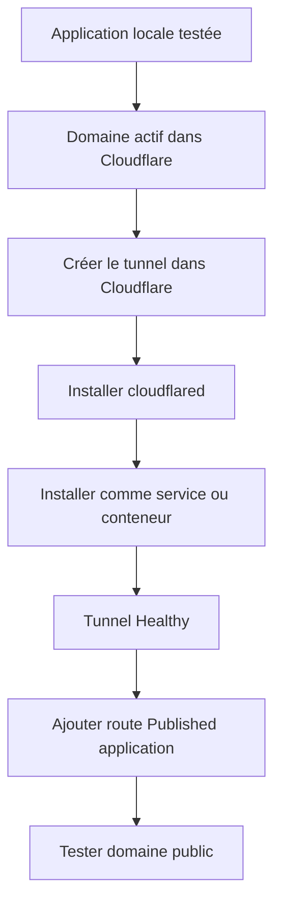

# 03 — Tunnel permanent Cloudflare

> À lire avant :
>
> 1. `00_Principes_et_Securite.md`
> 2. `01_Preparer_Domaine_Cloudflare.md`
>
> Ce guide sert à publier une application proprement avec un domaine du type `https://app.mondomaine.fr`.

---

## 1. Objectif

Créer un tunnel durable qui relie :

```text
https://app.mondomaine.fr
```

vers une application locale :

```text
http://localhost:8080
```

ou :

```text
http://192.168.1.50:8080
```

---

## 2. Vue d’ensemble



---

## 3. Où créer le tunnel dans Cloudflare ?

La méthode recommandée consiste à créer le tunnel depuis le Dashboard Cloudflare.

Dans le Dashboard Cloudflare, aller dans :

```text
Cloudflare Dashboard
→ panneau latéral gauche
→ Protect & Connect
→ Networking
→ Tunnels
```

Sur cette page, il est possible de voir les tunnels existants et leur état.

Un tunnel correctement connecté apparaît généralement avec un statut du type :

```text
Healthy
```

Créer ensuite le tunnel avec :

```text
Create Tunnel
```

> [!NOTE]
> Selon l’interface Cloudflare, certains menus peuvent encore passer par `Zero Trust`, `Networks`, `Connectors`, puis `Cloudflare Tunnels`.
>
> Si le menu a un nom légèrement différent, chercher surtout la logique : `Protect & Connect`, puis `Networking`, puis `Tunnels`.

---

## 4. Créer le tunnel

Dans la page des tunnels :

```text
Create Tunnel / Create a tunnel
→ choisir le connecteur cloudflared
→ donner un nom au tunnel
→ Save / Create Tunnel
```

Noms conseillés :

```text
serveur-linux-app
pc-windows-dashboard
maison-monitoring
prod-api
```

Noms à éviter :

```text
test
truc
new2
final-final
```

Le nom doit aider à comprendre quelle machine ou quel usage est relié au tunnel.

---

## 5. Choisir l’environnement d’installation

Après la création du tunnel, Cloudflare affiche généralement une étape de type :

```text
Install and run a connector
Setup environment
```

Il faut choisir l’environnement de la machine qui exécutera `cloudflared`.

| Environnement | Quand l’utiliser |
|---|---|
| Windows | PC ou serveur Windows. |
| Debian | Debian, Ubuntu, Raspberry Pi OS, Linux Mint. |
| Docker | `cloudflared` dans un conteneur. |
| macOS | Mac local ou serveur macOS. |

Choisir aussi l’architecture si l’interface le demande :

| Architecture | Exemple |
|---|---|
| 64-bit / amd64 | PC classique, serveur x86_64. |
| arm64 | Raspberry Pi récent, machine ARM 64 bits. |
| 32-bit | Ancien système 32 bits. |

Cloudflare affiche ensuite des commandes à copier. Il ne faut pas réécrire le token à la main.

Pendant l’installation, garder cette page Cloudflare ouverte. En bas de l’écran, Cloudflare affiche généralement un bloc de statut, par exemple :

```text
Connection Status
Waiting for your Tunnel to connect...
```

Après avoir lancé les commandes sur la machine Windows, Linux ou Docker, il faut attendre que ce statut indique que le tunnel est connecté.

Selon l’interface, le statut peut apparaître sous une forme proche de :

```text
Connected
Healthy
```

Tant que Cloudflare indique que le tunnel attend la connexion, il ne faut pas encore ajouter la route publique. Le connecteur `cloudflared` n’est pas encore correctement relié au tunnel.

---

## 6. Installation sur Windows

### 6.1. Télécharger et installer le MSI

Dans l’écran d’installation Windows du tunnel, Cloudflare propose le fichier `cloudflared` adapté, généralement :

```text
cloudflared-windows-amd64.msi
```

Installer le fichier MSI avec l’assistant Windows.

### 6.2. Ouvrir PowerShell en administrateur

```text
Menu Démarrer
→ PowerShell
→ clic droit
→ Exécuter en tant qu’administrateur
```

### 6.3. Installer le tunnel comme service

Dans Cloudflare, copier la commande Windows affichée.

Elle ressemble à :

```powershell
cloudflared.exe service install <TOKEN_DU_TUNNEL>
```

ou :

```powershell
cloudflared service install <TOKEN_DU_TUNNEL>
```

Coller cette commande dans PowerShell administrateur.

### 6.4. Vérifier le service Windows

```powershell
Get-Service cloudflared
```

Démarrer :

```powershell
Start-Service cloudflared
```

Redémarrer :

```powershell
Restart-Service cloudflared
```

---

## 7. Installation sur Linux Debian/Ubuntu/Raspberry Pi OS

Dans l’écran d’installation du tunnel, choisir :

```text
Operating System : Debian
Architecture : selon la machine
```

Cloudflare affiche des commandes à copier dans le terminal.

### 7.1. Installer `cloudflared`

Exemple représentatif :

```bash
sudo mkdir -p --mode=0755 /usr/share/keyrings
curl -fsSL https://pkg.cloudflare.com/cloudflare-main.gpg | sudo tee /usr/share/keyrings/cloudflare-main.gpg >/dev/null

echo 'deb [signed-by=/usr/share/keyrings/cloudflare-main.gpg] https://pkg.cloudflare.com/cloudflared any main' | sudo tee /etc/apt/sources.list.d/cloudflared.list

sudo apt-get update && sudo apt-get install cloudflared
```

Si le Dashboard Cloudflare affiche des commandes plus récentes, privilégier celles du Dashboard.

### 7.2. Installer le tunnel comme service

Commande donnée par Cloudflare :

```bash
sudo cloudflared service install <TOKEN_DU_TUNNEL>
```

### 7.3. Vérifier le service Linux

```bash
sudo systemctl status cloudflared
```

Démarrer :

```bash
sudo systemctl start cloudflared
```

Activer au démarrage :

```bash
sudo systemctl enable cloudflared
```

Redémarrer :

```bash
sudo systemctl restart cloudflared
```

Logs en direct :

```bash
sudo journalctl -u cloudflared -f
```

---

## 8. Installation avec Docker

### 8.1. Commande simple donnée par Cloudflare

Cloudflare donne une commande du type :

```bash
docker run cloudflare/cloudflared:latest tunnel --no-autoupdate run --token <TOKEN_DU_TUNNEL>
```

Elle fonctionne pour tester, mais elle n’est pas idéale durablement.

### 8.2. Version durable recommandée

```bash
docker run -d \
  --name cloudflared \
  --restart unless-stopped \
  cloudflare/cloudflared:latest \
  tunnel --no-autoupdate run --token <TOKEN_DU_TUNNEL>
```

### 8.3. Version Docker Compose

```yaml
services:
  cloudflared:
    image: cloudflare/cloudflared:latest
    container_name: cloudflared
    restart: unless-stopped
    command: tunnel --no-autoupdate run --token ${CLOUDFLARED_TOKEN}
```

Fichier `.env` :

```env
CLOUDFLARED_TOKEN=valeur_du_token
```

> [!WARNING]
> Ne jamais publier le fichier `.env` contenant le token.

### 8.4. Docker et Service URL

Si l’application est sur la machine hôte :

- Docker Desktop Windows/macOS :

```text
http://host.docker.internal:8080
```

- Linux avec réseau hôte :

```bash
docker run -d --network host ...
```

puis Service URL :

```text
http://localhost:8080
```

Si l’application est dans le même réseau Docker que `cloudflared` :

```text
http://nom_du_conteneur:port
```

Exemple :

```text
http://web:80
```

---

## 9. Vérifier que le tunnel est connecté

Dans Cloudflare :

```text
Cloudflare Dashboard
→ Protect & Connect
→ Networking
→ Tunnels
→ vérifier le statut du tunnel
```

ou :

```text
Zero Trust
→ Networks
→ Connectors
→ Cloudflare Tunnels
→ vérifier le statut du tunnel
```

Le tunnel doit apparaître en état :

```text
Healthy
```

Si le tunnel n’est pas `Healthy` ou si l’écran d’installation indique encore que Cloudflare attend la connexion, consulter `04_Depannage.md` avant d’ajouter la route publique.

---

## 10. Ajouter une route publique

Une fois le tunnel connecté, il faut relier un hostname public à l’application locale.

Dans Cloudflare :

```text
Tunnels
→ choisir le tunnel
→ Routes / Public Hostnames
→ Add route / Add public hostname
→ Published application
```

Si l’interface affiche un onglet `Overview`, la route peut se trouver en bas de page ou via `View All` / `Routes`.

---

## 11. Remplir le Hostname

Exemple :

```text
Subdomain : app
Domain    : mondomaine.fr
Path      : vide
```

Résultat :

```text
app.mondomaine.fr
```

Dans la majorité des cas, le champ `Path` doit rester vide.

Utiliser `Path` seulement pour publier une partie précise, par exemple :

```text
/api
```

---

## 12. Remplir le Service URL

Le **Service URL** est l’adresse locale réelle de l’application.

### Même machine que `cloudflared`

```text
http://localhost:8080
```

ou :

```text
http://127.0.0.1:8080
```

### Autre machine du réseau local

```text
http://192.168.1.50:8080
```

La machine qui exécute `cloudflared` doit pouvoir joindre cette IP.

### Application locale en HTTPS

```text
https://localhost:8443
```

Si l’application utilise un certificat auto-signé, il peut être nécessaire d’activer l’option avancée :

```text
No TLS Verify
```

### Application Docker même réseau

```text
http://web:80
```

---

## 13. Enregistrer la route

Une fois le hostname et le Service URL remplis :

```text
Add route / Save hostname
```

Cloudflare crée alors la route publique et le DNS nécessaire associé au tunnel.

---

## 14. Tester l’adresse publique

Dans un navigateur :

```text
https://app.mondomaine.fr
```

Tests utiles :

- fenêtre privée
- téléphone en 4G/5G
- autre réseau Internet
- vidage du cache DNS si nécessaire.

Si l’adresse ne répond pas correctement, utiliser `04_Depannage.md`.

---

## 15. Désinstaller complètement un tunnel permanent

Pour retirer proprement un tunnel permanent, il faut supprimer deux choses :

1. la configuration côté Cloudflare, c’est-à-dire la route publique et éventuellement le tunnel
2. le connecteur local, c’est-à-dire le service Windows, le service Linux ou le conteneur Docker

### 15.1. Supprimer la route et le tunnel dans Cloudflare

Dans le Dashboard Cloudflare :

```text
Cloudflare Dashboard
→ Protect & Connect
→ Networking
→ Tunnels
→ choisir le tunnel
→ Routes / Public Hostnames
→ supprimer la route publique concernée
```

Si le tunnel ne sert plus à aucune application, supprimer ensuite le tunnel lui-même depuis la page des tunnels.

Après suppression, vérifier aussi dans :

```text
Cloudflare Dashboard
→ sélectionner le domaine
→ DNS
→ Records
```

S’il reste un enregistrement DNS inutile pour l’ancien sous-domaine, le supprimer.

### 15.2. Désinstaller sur Windows

Ouvrir PowerShell en administrateur.

Vérifier le service :

```powershell
Get-Service cloudflared
```

Arrêter le service si nécessaire :

```powershell
Stop-Service cloudflared
```

Désinstaller le service :

```powershell
cloudflared service uninstall
```

Si `cloudflared` n’est pas dans le `PATH`, se placer dans le dossier de l’exécutable :

```powershell
cd C:\Cloudflared\bin
.\cloudflared.exe service uninstall
```

Si `cloudflared` a été installé avec `winget`, désinstaller le programme :

```powershell
winget uninstall --id Cloudflare.cloudflared
```

Si `cloudflared` a été installé avec le fichier MSI, le désinstaller depuis les applications Windows.

> [!WARNING]
> Supprimer les dossiers suivants seulement si la machine ne doit plus exécuter aucun tunnel Cloudflare.

```powershell
Remove-Item -Recurse -Force C:\Cloudflared
Remove-Item -Recurse -Force "$env:USERPROFILE\.cloudflared"
Remove-Item -Recurse -Force "C:\Windows\System32\config\systemprofile\.cloudflared"
```

### 15.3. Désinstaller sur Linux Debian/Ubuntu/Raspberry Pi OS

Désinstaller le service :

```bash
sudo cloudflared service uninstall
```

Vérifier que le service n’est plus présent :

```bash
sudo systemctl status cloudflared
```

Si le service existe encore, l’arrêter puis le désactiver :

```bash
sudo systemctl stop cloudflared
sudo systemctl disable cloudflared
```

Supprimer ensuite le paquet :

```bash
sudo apt-get purge cloudflared
sudo apt-get autoremove
```

Supprimer les fichiers de dépôt ajoutés pour `cloudflared` :

```bash
sudo rm -f /etc/apt/sources.list.d/cloudflared.list
sudo rm -f /usr/share/keyrings/cloudflare-main.gpg
sudo apt-get update
```

> [!WARNING]
> Supprimer les dossiers suivants seulement si aucun autre tunnel Cloudflare n’utilise cette machine.

```bash
rm -rf ~/.cloudflared
sudo rm -rf /etc/cloudflared
```

### 15.4. Désinstaller avec Docker

Si le tunnel a été lancé avec `docker run`, supprimer le conteneur :

```bash
docker rm -f cloudflared
```

Supprimer l’image si elle n’est plus utile :

```bash
docker image rm cloudflare/cloudflared:latest
```

Si un réseau Docker dédié avait été créé uniquement pour le tunnel, le supprimer :

```bash
docker network rm tunnel_net
```

Si le tunnel a été lancé avec Docker Compose, se placer dans le dossier du fichier `compose.yml`, puis arrêter et supprimer le conteneur :

```bash
docker compose down
```

Supprimer ensuite le fichier `.env` uniquement s’il ne contient que le token du tunnel supprimé :

```bash
rm -f .env
```

---

## Sources utiles

- Créer un tunnel depuis le Dashboard principal : https://developers.cloudflare.com/tunnel/setup/
- Créer un tunnel depuis Zero Trust : https://developers.cloudflare.com/cloudflare-one/networks/connectors/cloudflare-tunnel/get-started/create-remote-tunnel/
- Exécution comme service : https://developers.cloudflare.com/cloudflare-one/networks/connectors/cloudflare-tunnel/do-more-with-tunnels/local-management/as-a-service/
- Désinstallation du service `cloudflared` : https://developers.cloudflare.com/tunnel/troubleshooting/
- Téléchargement et paquets `cloudflared` : https://developers.cloudflare.com/tunnel/downloads/
- Cloudflare Tunnel : https://developers.cloudflare.com/cloudflare-one/networks/connectors/cloudflare-tunnel/
