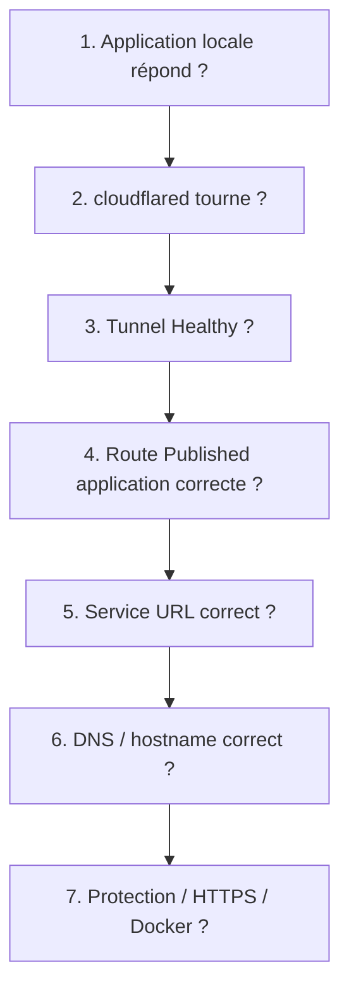

# 04 — Dépannage Cloudflare Tunnel

> À utiliser quand le tunnel ne marche pas, quand l’application ne s’affiche pas, ou quand une erreur apparaît.

---

## 1. Méthode de diagnostic rapide

Toujours vérifier dans cet ordre :



L’objectif est d’éviter de chercher dans Cloudflare alors que l’application locale ne répond pas, ou inversement.

---

## 2. Où vérifier dans Cloudflare ?

### Statut du tunnel

```text
Cloudflare Dashboard
→ Networking
→ Tunnels
→ vérifier le statut du tunnel
```

ou :

```text
Zero Trust
→ Networks
→ Connectors
→ Cloudflare Tunnels
→ vérifier le statut du tunnel
```

Le tunnel doit être `Healthy`.

### Route publique

```text
Tunnels
→ choisir le tunnel
→ Routes / Public Hostnames
→ vérifier le hostname
→ vérifier le Service URL
```

### DNS du domaine

```text
Cloudflare Dashboard
→ sélectionner le domaine
→ DNS
→ Records
```

### Nameservers du domaine

Les nameservers se vérifient chez le registrar, pas seulement dans Cloudflare :

```text
Registrar
→ Domaines
→ sélectionner le domaine
→ DNS / Nameservers / Serveurs DNS
```

---

## 3. Test local obligatoire

Sur Linux/macOS :

```bash
curl -I http://localhost:8080
```

Sur Windows :

```powershell
curl.exe -I http://localhost:8080
```

Si l’application est sur une autre machine :

```bash
curl -I http://192.168.1.50:8080
```

Si ce test échoue depuis la machine qui exécute `cloudflared`, le problème vient de l’application locale, du port, du protocole, du pare-feu local ou du réseau Docker.

---

## 4. Tunnel déconnecté / pas Healthy

### Windows

```powershell
Get-Service cloudflared
Start-Service cloudflared
Restart-Service cloudflared
```

### Linux

```bash
sudo systemctl status cloudflared
sudo systemctl restart cloudflared
sudo journalctl -u cloudflared -f
```

### Docker

```bash
docker ps
docker logs cloudflared
docker restart cloudflared
```

Causes possibles :

- service non démarré ;
- token incorrect ;
- tunnel supprimé ou recréé ;
- machine sans Internet ;
- pare-feu/antivirus qui bloque `cloudflared` ;
- conteneur Docker arrêté ;
- mauvaise commande copiée depuis Cloudflare.

---

## 5. Erreur 502 Bad Gateway

Une erreur 502 signifie souvent :

> Cloudflare atteint le tunnel, mais `cloudflared` n’arrive pas à joindre l’application locale.

À vérifier :

| Point | Exemple |
|---|---|
| Application démarrée | Le service local tourne réellement. |
| Port correct | `8080`, `3000`, `80`, etc. |
| Protocole correct | `http://` ou `https://`. |
| Adresse correcte | `localhost`, IP LAN, nom Docker. |
| Pare-feu local | Le port local n’est pas bloqué. |
| Docker | `localhost` ne pointe pas vers le mauvais conteneur. |

Test :

```bash
curl -I http://localhost:8080
```

Si l’application est sur une autre machine :

```bash
curl -I http://192.168.1.50:8080
```

---

## 6. 502 avec Docker

C’est très souvent un problème de réseau Docker.

### Mauvais cas fréquent

```text
cloudflared dans Docker
Service URL : http://localhost:8080
```

Ici, `localhost` pointe vers le conteneur `cloudflared`, pas vers l’application.

### Solutions possibles

Si l’application est dans un autre conteneur du même réseau :

```text
Service URL : http://nom_du_conteneur:port
```

Exemple :

```text
Service URL : http://web:80
```

Si l’application tourne sur l’hôte avec Docker Desktop :

```text
Service URL : http://host.docker.internal:8080
```

Si Linux avec réseau hôte :

```bash
docker run --network host ...
```

puis :

```text
Service URL : http://localhost:8080
```

---

## 7. Erreur 1016

Une erreur 1016 indique généralement un problème DNS ou routage Cloudflare.

À vérifier dans Cloudflare :

```text
Cloudflare Dashboard
→ sélectionner le domaine
→ DNS
→ Records
```

puis :

```text
Tunnels
→ choisir le tunnel
→ Routes / Public Hostnames
```

Points à contrôler :

- domaine actif dans Cloudflare ;
- sous-domaine correctement écrit ;
- route créée dans le bon tunnel ;
- tunnel `Healthy` ;
- domaine sélectionné dans le champ `Domain` ;
- tunnel non supprimé puis recréé sans mise à jour de la route.

Commandes utiles :

```bash
nslookup app.mondomaine.fr
nslookup -type=ns mondomaine.fr
```

---

## 8. Erreur 404

Une erreur 404 peut venir de deux endroits :

1. Cloudflare ne trouve pas la bonne route.
2. L’application locale répond elle-même 404.

Dans Cloudflare, vérifier :

```text
Tunnels
→ choisir le tunnel
→ Routes / Public Hostnames
→ hostname
→ Path
→ Service URL
```

À contrôler :

- le sous-domaine demandé est le bon ;
- la route existe ;
- le champ `Path` est vide ou volontairement renseigné ;
- l’application locale possède bien la page demandée ;
- le Service URL cible la bonne application.

---

## 9. Erreur de boucle HTTPS / redirections infinies

Symptôme possible :

```text
ERR_TOO_MANY_REDIRECTS
```

Causes possibles :

- l’application force HTTPS localement ;
- Cloudflare force HTTPS publiquement ;
- mauvais mode SSL/TLS ;
- proxy mal compris par l’application ;
- en-têtes `X-Forwarded-*` attendus mais non gérés.

À vérifier :

- utiliser HTTP local si possible : `http://localhost:8080` ;
- vérifier les réglages HTTPS de l’application ;
- vérifier les réglages SSL/TLS Cloudflare ;
- vérifier les en-têtes proxy si l’application en dépend.

---

## 10. Le domaine ne pointe pas encore vers Cloudflare

Vérifier les nameservers :

```bash
nslookup -type=ns mondomaine.fr
```

Le résultat doit afficher les serveurs DNS Cloudflare fournis pour le domaine.

Si les DNS du registrar apparaissent encore, la modification n’est pas faite ou la propagation n’est pas terminée.

Côté site du registrar, vérifier :

```text
Registrar
→ Domaines
→ sélectionner le domaine
→ Serveurs DNS / Nameservers
```

---

## 11. La route existe mais l’application ne s’affiche pas

Diagnostic court :

| Étape | Où vérifier |
|---|---|
| Domaine actif | Cloudflare Dashboard → Websites / Sites |
| Tunnel `Healthy` | Networking → Tunnels ou Zero Trust → Networks → Connectors |
| Route publique | Tunnel → Routes / Public Hostnames |
| Hostname | Champ `Subdomain` + `Domain` |
| Service URL | Route du tunnel |
| Application locale | `curl -I http://localhost:8080` |
| Docker | Réseau Docker, `host.docker.internal`, nom du conteneur |
| Pare-feu local | Système Windows/Linux, antivirus, firewall |

---

## 12. Décider rapidement où est le problème

| Symptôme | Cause probable |
|---|---|
| L’application ne répond pas en `curl localhost` | Application locale arrêtée ou mauvais port. |
| Tunnel pas `Healthy` | `cloudflared`, service, token ou réseau. |
| Erreur 502 | Service URL faux ou application inaccessible par `cloudflared`. |
| Erreur 1016 | DNS, hostname ou route Cloudflare. |
| Erreur 404 | Mauvais hostname/path ou route interne de l’application. |
| Fonctionne en local mais pas en Docker | Problème réseau Docker ou `localhost`. |
| Fonctionne en Wi-Fi mais pas en 4G | DNS, cache, route publique ou protection. |

---

## 13. Repartir proprement

Si la configuration est confuse, la méthode la plus sûre est de simplifier :

1. supprimer uniquement la route publique incorrecte ;
2. conserver le tunnel si son statut est `Healthy` ;
3. tester l’application localement depuis la machine `cloudflared` ;
4. recréer une route simple sans `Path` ;
5. utiliser un seul sous-domaine ;
6. ajouter Cloudflare Access seulement après validation du fonctionnement de base.

---

## Sources utiles

- Dépannage Cloudflare Tunnel : https://developers.cloudflare.com/tunnel/troubleshooting/
- Erreurs Cloudflare Tunnel : https://developers.cloudflare.com/cloudflare-one/networks/connectors/cloudflare-tunnel/troubleshoot-tunnels/common-errors/
- Création d’un tunnel : https://developers.cloudflare.com/tunnel/setup/
